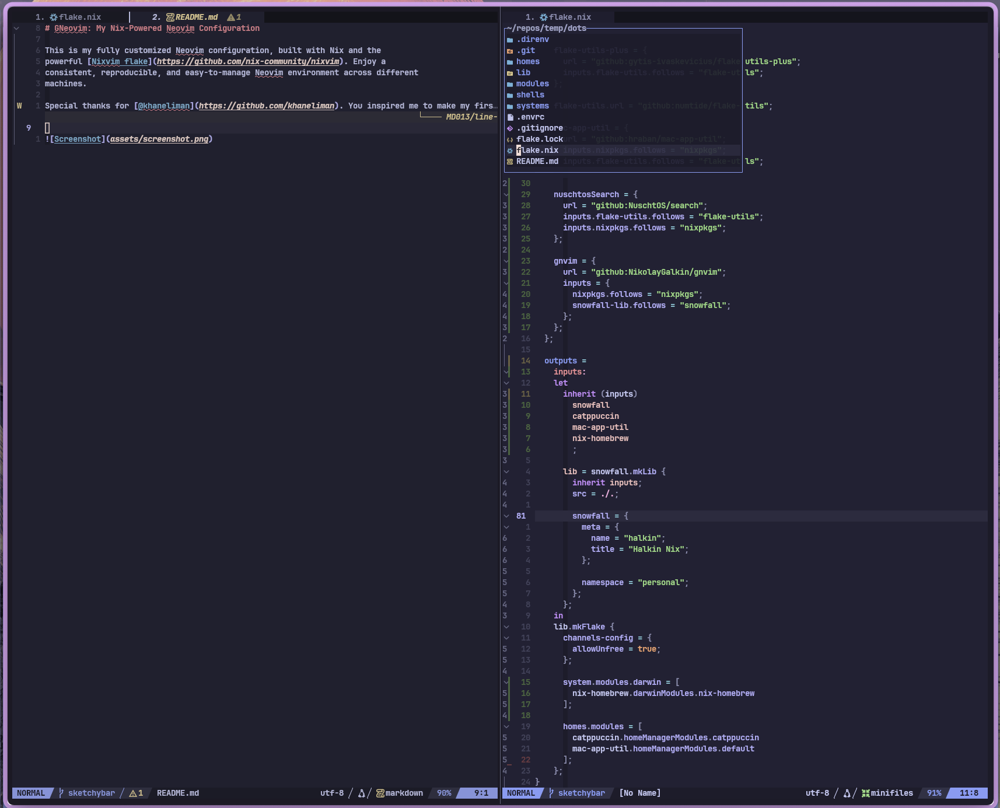

# GNeovim: My Nix-Powered Neovim Configuration

This is my fully customized Neovim configuration, built with Nix and the
powerful [Nixvim flake](https://github.com/nix-community/nixvim). Enjoy a
consistent, reproducible, and easy-to-manage Neovim environment across different
machines.

Special thanks for [@khaneliman](https://github.com/khaneliman). You inspired me to make my first nix package.

